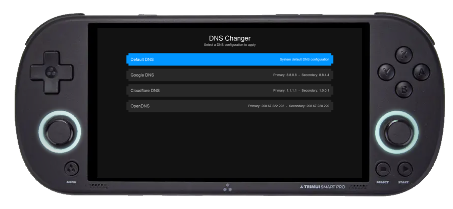

# DNS Changer

A modern, full-screen DNS configuration tool with controller support, designed for easy DNS server switching.



## Features

- 🎮 Full controller support (Trimui Smart Pro compatible)
- 🖥️ Full-screen modern interface
- 🌙 Beautiful dark theme
- ⚡ Quick DNS switching
- 🔄 Automatic screen scaling

## Supported DNS Servers

- Google DNS
- Cloudflare DNS
- OpenDNS

## Installation

1. Download the latest release.
    - https://github.com/ahmadteeb/TSP_DNSChanger/releases
2. Extract the downloaded file to:
    - /mnt/SDCARD/Apps/

## Requirements

- Python 3.x
- SDL2
- SDL2_ttf
- A controller (optional)


## Cross-Compiling

1. Clone the repository:
```bash
git clone [repository-url]
cd TSB_DNSChanger
```

2. Using WSL2 run the docker container inside tools directory and place the code inside workspace:
```bash
sudo make shell
```

3. Cross compiling the app to Trimui Smart Pro:
```bash
pyinstaller --onefile --noconsole --name DNSChanger main.py
```
4. Place the EmuDrop files from dist/ directory platform/Trimui Smart Pro/EmuDrop
```bash
cp dist/DNSChanger/ platform/Trimui Smart Pro/DNSChanger
```

5. Copy DNSChanger directory to /mnt/SDCARD/Apps/


## Testing

```bash
python main.py
```

## Controls

### Keyboard:
- ↑/↓: Navigate through DNS options
- Enter: Select and apply DNS
- Escape: Exit application

### Controller (Trimui Smart Pro):
- D-pad Up/Down: Navigate through DNS options
- A Button: Select and apply DNS
- B Button: Exit application

### DNS Configuration

The application reads DNS configurations from `dns_list.json`. Here's an example format:

```json

[
    {
      "name": "Google DNS",
      "primary": "8.8.8.8",
      "secondary": "8.8.4.4"
    },
    ...
]
```

